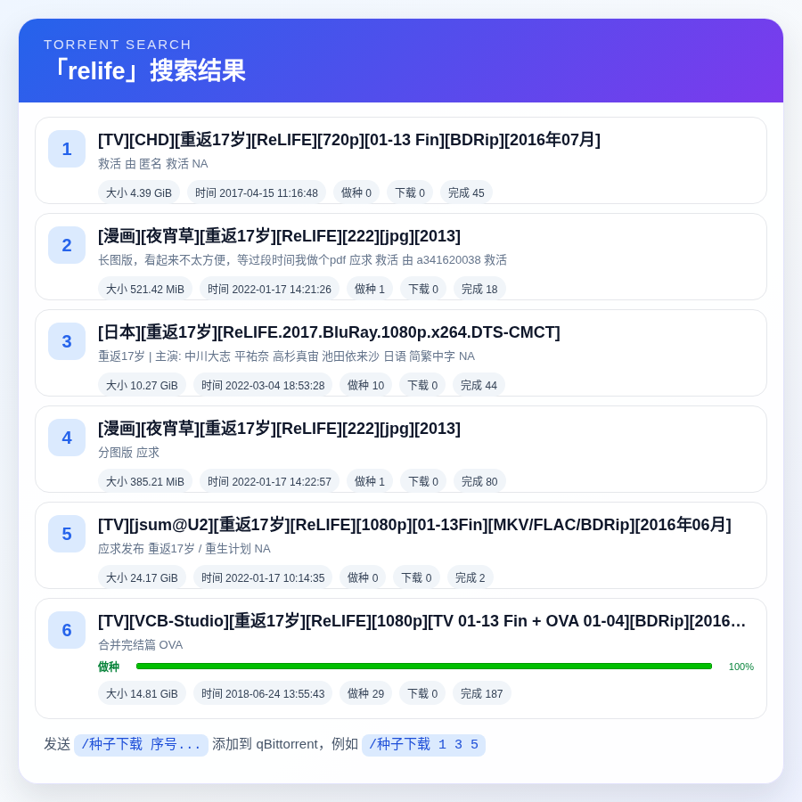

<div align="center">

# AstrBot qBittorrent Manager

_✨ 按 QQ 用户独立配置 PT 站，并推送到 qBittorrent / uTorrent 下载 ✨_


</div>

## 📌 插件简介

这是一个基于 [AstrBot](https://github.com/AstrBotDevs/AstrBot) 的下载客户端管理插件。

插件支持用户在 QQ 群或私聊中搜索 PT 站种子，默认适配北洋园 PT（天津大学 PT 站），搜索结果会通过 AstrBot 自带的 t2i 服务渲染为卡片。每位用户按照 QQ 号使用独立配置，可以选择自己的 PT 站点、Cookie、qBittorrent 或 uTorrent 客户端。

> 默认面向 NexusPHP 风格站点设计，其他同类 PT 站可通过配置搜索地址适配。

### M-Team API

当前仓库版本 `v1.7.0-beta.2` 为 M-Team API 测试版。将 `provider_type` 设置为 `mteam` 后，插件使用 M-Team API 搜索和下载，不再解析网页。默认使用 `https://api.m-team.cc`、`POST /api/torrent/search` 和 `POST /api/torrent/genDlToken`；配置 `mteam_api_token` 后即可使用。根据官方 Wiki，第三方调用必须将 Access Token 放在 `x-api-key` 请求头中；请勿使用 Cookie 代替 API Token。建议先将 `provider_base_url` 设置为 `https://test2.m-team.cc` 验证搜索和下载流程，再切换到生产站点。

## 🖼️ 效果预览



## ✨ 功能特性

- 🔍 **群聊搜索**：使用 `/种子 关键词` 搜索 PT 站种子，并可按时间、做种、下载、完成、大小或标题排序。
- 🖼️ **卡片渲染**：使用 AstrBot t2i 服务将搜索结果渲染为图片卡片。
- 📊 **种子状态**：在搜索卡片中显示当前 PT 账号的下载、做种、完成等状态及进度条。
- ⬇️ **批量下载**：使用 `/种子下载 1 3 5` 一次添加多个搜索结果到 qBittorrent 或 uTorrent。
- 🔗 **直接下载**：使用 `/直接下载` 添加磁链或 HTTP(S) `.torrent` 链接。
- 👥 **独立用户配置**：按 QQ 号隔离 PT 账号、下载客户端和搜索结果。
- ⚙️ **双入口配置**：管理员可在 AstrBot 面板维护用户配置，用户也可在群聊或私聊中自行配置。
- ⏱️ **选择超时**：搜索结果默认缓存 10 分钟，超时需重新搜索。
- 🛡️ **友好容错**：处理无结果、序号错误、Cookie 失效、qBittorrent 登录失败、渲染失败等情况。

## 📦 安装方法

### 方式一：AstrBot 插件市场

如果本插件已上架 AstrBot 插件市场，可直接在 AstrBot 管理面板中搜索并安装。

### 方式二：手动安装

将本仓库放入 AstrBot 的插件目录后重启 AstrBot：

```bash
git clone <本仓库地址>
```

然后在 AstrBot 插件管理页面启用本插件，并根据下方说明填写配置。

## ⚙️ 配置说明

| 配置项 | 必填 | 默认值 | 说明 |
| --- | --- | --- | --- |
| `provider_type` | 否 | `nexusphp` | PT 站点类型，可选 `nexusphp` 或 `mteam`。 |
| `provider_base_url` | 否 | `https://www.tjupt.org/` | PT 站点根地址；M-Team 可填写 `https://api.m-team.cc`。 |
| `provider_search_path` | 否 | `torrents.php?search={keyword}&incldead=0` | 搜索路径，必须包含 `{keyword}` 占位符。 |
| `provider_cookie` | 是 | 空 | PT 站登录 Cookie，用于搜索和下载 `.torrent` 文件。 |
| `mteam_api_token` | M-Team 必填 | 空 | M-Team API Token。建议仅在私聊或 AstrBot 面板中设置。 |
| `mteam_search_path` | 否 | `/api/torrent/search` | M-Team API 搜索接口路径。 |
| `mteam_download_path` | 否 | `/api/torrent/genDlToken` | M-Team 获取临时种子下载链接的接口路径。 |
| `download_client` | 否 | `qbittorrent` | 下载客户端类型，可选 `qbittorrent` 或 `utorrent`。 |
| `qb_url` | 选择 qBittorrent 时必填 | 空 | qBittorrent WebUI 地址，例如 `http://127.0.0.1:8080`。 |
| `qb_username` | 否 | 空 | qBittorrent WebUI 用户名。 |
| `qb_password` | 否 | 空 | qBittorrent WebUI 密码。 |
| `qb_save_path` | 否 | 空 | qBittorrent 保存路径，留空则使用 qBittorrent 默认设置。 |
| `qb_category` | 否 | 空 | qBittorrent 分类，留空则不设置分类。 |
| `qb_paused` | 否 | `false` | 添加任务后是否暂停。 |
| `ut_url` | 选择 uTorrent 时必填 | 空 | uTorrent WebUI 地址，例如 `http://127.0.0.1:8080`。 |
| `ut_username` | 否 | 空 | uTorrent WebUI 用户名。 |
| `ut_password` | 否 | 空 | uTorrent WebUI 密码。 |
| `direct_torrent_max_size_mb` | 否 | `50` | 直接下载 HTTP(S) 种子链接时允许的最大响应大小，防止误传大文件。 |
| `max_results` | 否 | `10` | 每次搜索最多展示的结果数，范围 `1-30`。 |
| `cache_ttl_seconds` | 否 | `600` | 搜索结果等待选择的超时时间，默认 10 分钟。 |
| `render_width` | 否 | `900` | 结果卡片渲染宽度，高度会按结果数自动计算。 |
| `request_timeout` | 否 | `20` | 网络请求超时时间，单位秒。 |
| `access_whitelist` | 否 | 空列表 | 插件用户白名单。非空时仅列表中的 QQ 用户可以使用插件。 |
| `access_blacklist` | 否 | 空列表 | 插件用户黑名单。禁止列表中的 QQ 用户使用插件。 |
| `access_admin_bypass` | 否 | `true` | AstrBot 管理员是否绕过插件白名单和黑名单。 |
| `global_config_admin_only` | 否 | `false` | 是否仅允许 AstrBot 管理员继承全局 PT 和下载客户端配置。 |
| `enable_user_config_commands` | 否 | `true` | 是否允许用户通过消息命令维护个人配置。 |
| `user_profiles` | 否 | 空列表 | 按 QQ 号维护的用户独立配置，可在面板中添加多条。 |

现有配置项作为全局默认值继续生效。`user_profiles` 中与发送者 QQ 号匹配的配置会覆盖全局默认值，因此旧版本升级后无需立即迁移；用户通过消息命令保存的配置也会写入 `user_profiles`。

### 用户配置优先级

```text
QQ 用户独立配置 > AstrBot 面板全局默认配置 > 插件内置默认值
```

面板中的每条用户配置需要填写 QQ 号，并可独立设置 PT 站点、搜索路径、Cookie、下载客户端、WebUI 地址、账号密码、保存路径、结果数量、缓存时间和请求超时等参数。

开启 `global_config_admin_only` 后，普通用户不会继承 AstrBot 面板中的全局 PT Cookie、WebUI 地址和账号密码。普通用户仍可使用自己的 `user_profiles` 配置，未设置的项目回退到插件内置默认值；AstrBot 管理员仍按上述完整优先级使用配置。

### 权限控制

- `access_blacklist` 命中的用户会被拒绝使用搜索、下载、帮助和个人配置命令。
- `access_whitelist` 为空时不限制普通用户；非空时仅白名单用户可用。
- 普通用户同时出现在白名单和黑名单时，黑名单优先。
- `access_admin_bypass` 开启时，AstrBot 中配置的管理员 ID 不受白名单和黑名单限制。
- 关闭管理员绕过后，管理员与普通用户遵循相同的白名单和黑名单规则。

管理员身份直接使用 AstrBot 消息事件的管理员权限判断，不需要在本插件中重复填写管理员 QQ 号。

## 🍪 Cookie 填写说明

北洋园 PT 登录态通常依赖 `access_token`。推荐在浏览器开发者工具中复制搜索页面请求的 Cookie。

通常可填写：

```text
access_token=你的真实值; ip_notice_ignore=1
```

如果搜索或下载失败，可以改为填写浏览器复制到的完整 Cookie。

> `access_token` 等同登录凭证，请不要发到群聊、截图或公开仓库中。

## 🚀 使用方法

### 配置个人账号

查看当前生效配置：

```text
/种子配置 查看
```

设置配置项：

```text
/种子配置 设置 客户端 qbittorrent
/种子配置 设置 站点 https://www.tjupt.org/
/种子配置 设置 搜索路径 torrents.php?search={keyword}&incldead=0
/种子配置 设置 cookie access_token=你的真实值
/种子配置 设置 qb地址 http://127.0.0.1:8080
/种子配置 设置 qb用户名 admin
/种子配置 设置 qb密码 你的密码
```

M-Team 用户可设置：

```text
/种子配置 设置 站点类型 mteam
/种子配置 设置 站点 https://api.m-team.cc
/种子配置 设置 mteam令牌 你的 API Token
```

uTorrent 用户可以设置：

```text
/种子配置 设置 客户端 utorrent
/种子配置 设置 ut地址 http://127.0.0.1:8080
/种子配置 设置 ut用户名 admin
/种子配置 设置 ut密码 你的密码
```

删除单个个人配置并恢复全局默认值：

```text
/种子配置 删除 qb密码
```

清除自己的全部配置：

```text
/种子配置 重置
```

查看完整配置项和示例：

```text
/种子配置 帮助
```

配置命令在群聊和私聊中都可以使用。Cookie、WebUI 密码等敏感信息在机器人回复中只显示“已设置”，不会原文回显；但群聊中的原始命令仍可能被其他成员看到，建议在私聊中设置敏感项。

### 搜索种子

```text
/种子 Ubuntu
```

机器人会返回搜索结果卡片。

如果 PT 站搜索页面提供当前用户的种子状态，结果卡片会在对应条目中显示“状态 + 进度条 + 百分比”。状态文字位于进度条左侧，下载使用蓝色、做种使用绿色，完成或暂停等非活动状态使用灰色；没有状态数据的条目不会显示空进度条。

> 此处显示的是当前用户 Cookie 对应的 PT 站账号状态，并非 qBittorrent 或 uTorrent 客户端的实时任务状态。不同 NexusPHP 站点是否提供该信息取决于站点页面结构和账号登录状态。

需要排序时，在搜索词前添加排序选项，并使用独立的 `--` 分隔参数和搜索词：

```text
/种子 --sort=时间 --order=降序 -- Ubuntu Server
/种子 --sort=做种 --order=降序 -- 漆黑的子弹
/种子 --排序=完成 --顺序=升序 -- [VCB-Studio] 特殊标题
```

排序字段支持 `时间/time`、`做种/seeders`、`下载/leechers`、`完成/completed`、`大小/size` 和 `标题/title`；顺序支持 `升序/asc` 与 `降序/desc`。省略 `--order` 时默认降序。

兼容中文输入法可能产生的全角符号，例如下面的写法也可以识别：

```text
/种子 －－排序＝做种 －－顺序＝降序 －－ 碧蓝航线
/种子 ——排序＝完成 ——顺序＝升序 —— 碧蓝航线
```

只有分隔符前的内容会被当作参数，分隔符后的内容会完整作为搜索词，因此关键词可以安全包含空格、等号、方括号和短横线等特殊字符。不需要排序时继续使用原来的 `/种子 关键词` 即可，插件不会额外询问排序方式。

如果搜索词本身恰好以 `--sort=`、`--排序=` 等参数外观开头，可以在前面加一个独立的 `--` 进行转义，例如 `/种子 -- --sort=seeders 特殊标题`。

### 添加下载

```text
/种子下载 1
```

插件会下载第 1 个结果的 `.torrent` 文件，并上传到配置的下载客户端。

也可以一次选择多个结果，序号使用空格或逗号分隔：

```text
/种子下载 1 3 5
/种子下载 1,3,5
```

插件会在执行前校验全部序号。如果当前只有 3 条结果，而用户发送 `/种子下载 1 4 6`，本次操作会直接拒绝，不会先添加第 1 条再报错。重复序号会自动去重；下载客户端请求阶段的成功和失败结果会统一汇总返回。

### 直接添加磁链

```text
/直接下载 magnet:?xt=urn:btih:...
```

也可以使用别名：

```text
/磁链下载 magnet:?xt=urn:btih:...
```

### 直接添加种子链接

```text
/直接下载 https://example.com/example.torrent
```

也可以使用别名：

```text
/链接下载 https://example.com/example.torrent
```

HTTP(S) 链接会先由插件下载并校验为 `.torrent` 文件，再上传到下载客户端；磁链会直接交给下载客户端处理。

### 查看帮助

```text
/种子帮助
```

## 🧩 下载客户端说明

### qBittorrent

- 将 `download_client` 设置为 `qbittorrent`，这是默认值。
- 请确保 qBittorrent 已启用 WebUI。
- `qb_url` 应填写 AstrBot 所在环境可访问的地址。
- `qb_save_path` 和 `qb_category` 留空时，qBittorrent 会使用自身默认下载规则。
- 磁链通过 qBittorrent Web API 的 URL 添加能力处理。
- WebAPI 兼容 qBittorrent 5.2 的 `204 No Content`、任务计数 JSON 和 `202 Accepted` 响应，同时保留对旧版本 `Ok.` 响应的支持，无需额外配置。

### uTorrent

- 将 `download_client` 设置为 `utorrent`。
- 请确保 uTorrent 已启用 WebUI。
- `ut_url` 填写 WebUI 根地址，例如 `http://127.0.0.1:8080`，不需要手动加 `/gui`。
- 当前 uTorrent 支持上传 `.torrent` 文件添加任务；保存路径、分类、暂停等高级选项仍建议在 uTorrent 客户端内设置默认规则。
- 磁链通过 uTorrent WebUI 的 `add-url` 能力处理。

### 网络地址

- 如果 AstrBot 运行在 Docker 中，`127.0.0.1` 指向容器自身，不一定是宿主机。
- 请填写 AstrBot 运行环境能够访问到的客户端 WebUI 地址。

## 🌐 代理说明

插件使用 `httpx` 发起网络请求。若 AstrBot 进程环境变量中配置了代理，`httpx` 默认会读取：

```bash
HTTP_PROXY=http://127.0.0.1:7897
HTTPS_PROXY=http://127.0.0.1:7897
```

如果只是浏览器或系统代理开启，但 AstrBot 进程没有继承这些环境变量，则插件不一定会走代理。

## ⚠️ 注意事项

- 本插件不会绕过 PT 站权限，搜索和下载均依赖有效登录 Cookie。
- 请遵守 PT 站点规则，不要滥用搜索和下载功能。
- 请遵守所在地法律法规，插件仅提供任务添加能力。
- Cookie、qBittorrent/uTorrent 密码等敏感配置请妥善保管，建议仅通过 AstrBot 面板或机器人私聊设置。
- 开启用户自助配置后，机器人所在环境必须能够访问用户填写的 PT 和 WebUI 地址。
- 建议在公开群聊中启用白名单，或至少维护黑名单并限制全局配置仅管理员使用。

## 📄 开源协议

本项目使用 GNU Affero General Public License v3.0（AGPL-3.0）开源。
