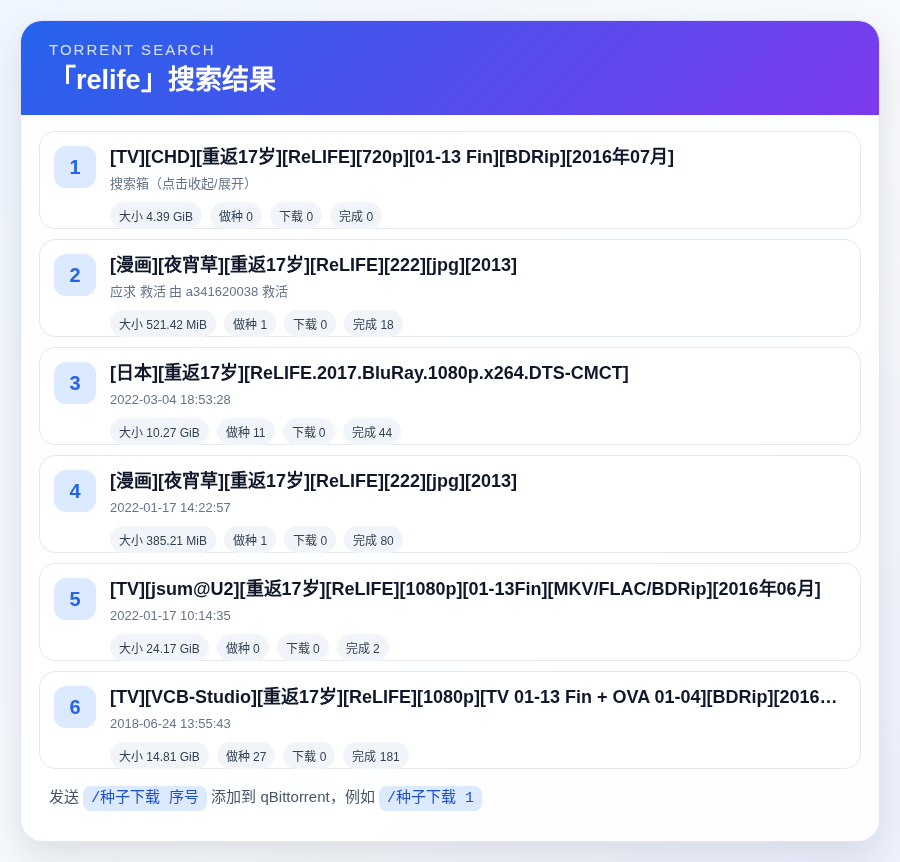

<div align="center">


# AstrBot qBittorrent Manager

_✨ 在 QQ 群中搜索 PT 种子，并一键推送到 qBittorrent 下载 ✨_


</div>

## 📌 插件简介

这是一个基于 [AstrBot](https://github.com/AstrBotDevs/AstrBot) 的 qBittorrent 管理插件。

插件支持用户在 QQ 群中通过命令搜索 PT 站种子，默认适配北洋园 PT（天津大学 PT 站），搜索结果会通过 AstrBot 自带的 t2i 服务渲染为卡片。用户选择序号后，插件会下载对应 `.torrent` 文件并上传到配置好的 qBittorrent 客户端。

> 默认面向 NexusPHP 风格站点设计，其他同类 PT 站可通过配置搜索地址适配。

## 🖼️ 效果预览



## ✨ 功能特性

- 🔍 **群聊搜索**：使用 `/种子 关键词` 搜索 PT 站种子。
- 🖼️ **卡片渲染**：使用 AstrBot t2i 服务将搜索结果渲染为图片卡片。
- ⬇️ **一键下载**：使用 `/种子下载 序号` 将种子添加到 qBittorrent。
- 👥 **多人隔离**：按用户缓存搜索结果，避免群内多人选择互相干扰。
- ⏱️ **选择超时**：搜索结果默认缓存 10 分钟，超时需重新搜索。
- 🛡️ **友好容错**：处理无结果、序号错误、Cookie 失效、qBittorrent 登录失败、渲染失败等情况。

## 📦 安装方法

### 方式一：AstrBot 插件市场

如果本插件已上架 AstrBot 插件市场，可直接在 AstrBot 管理面板中搜索并安装。

### 方式二：手动安装

将本仓库放入 AstrBot 的插件目录后重启 AstrBot：

```bash
git clone <本仓库地址>
```

然后在 AstrBot 插件管理页面启用本插件，并根据下方说明填写配置。

## ⚙️ 配置说明

| 配置项 | 必填 | 默认值 | 说明 |
| --- | --- | --- | --- |
| `provider_base_url` | 否 | `https://www.tjupt.org/` | PT 站点根地址，默认北洋园 PT。 |
| `provider_search_path` | 否 | `torrents.php?search={keyword}&incldead=0` | 搜索路径，必须包含 `{keyword}` 占位符。 |
| `provider_cookie` | 是 | 空 | PT 站登录 Cookie，用于搜索和下载 `.torrent` 文件。 |
| `qb_url` | 是 | 空 | qBittorrent WebUI 地址，例如 `http://127.0.0.1:8080`。 |
| `qb_username` | 否 | 空 | qBittorrent WebUI 用户名。 |
| `qb_password` | 否 | 空 | qBittorrent WebUI 密码。 |
| `qb_save_path` | 否 | 空 | qBittorrent 保存路径，留空则使用 qBittorrent 默认设置。 |
| `qb_category` | 否 | 空 | qBittorrent 分类，留空则不设置分类。 |
| `qb_paused` | 否 | `false` | 添加任务后是否暂停。 |
| `max_results` | 否 | `10` | 每次搜索最多展示的结果数，范围 `1-30`。 |
| `cache_ttl_seconds` | 否 | `600` | 搜索结果等待选择的超时时间，默认 10 分钟。 |
| `render_width` | 否 | `900` | 结果卡片渲染宽度，高度会按结果数自动计算。 |
| `request_timeout` | 否 | `20` | 网络请求超时时间，单位秒。 |

## 🍪 Cookie 填写说明

北洋园 PT 登录态通常依赖 `access_token`。推荐在浏览器开发者工具中复制搜索页面请求的 Cookie。

通常可填写：

```text
access_token=你的真实值; ip_notice_ignore=1
```

如果搜索或下载失败，可以改为填写浏览器复制到的完整 Cookie。

> `access_token` 等同登录凭证，请不要发到群聊、截图或公开仓库中。

## 🚀 使用方法

### 搜索种子

```text
/种子 Ubuntu
```

机器人会返回搜索结果卡片。

### 添加下载

```text
/种子下载 1
```

插件会下载第 1 个结果的 `.torrent` 文件，并上传到 qBittorrent。

### 查看帮助

```text
/种子帮助
```

## 🧩 qBittorrent 说明

- 请确保 qBittorrent 已启用 WebUI。
- `qb_url` 应填写 AstrBot 所在环境可访问的地址。
- 如果 AstrBot 运行在 Docker 中，`127.0.0.1` 指向容器自身，不一定是宿主机。
- `qb_save_path` 和 `qb_category` 留空时，qBittorrent 会使用自身默认下载规则。

## 🌐 代理说明

插件使用 `httpx` 发起网络请求。若 AstrBot 进程环境变量中配置了代理，`httpx` 默认会读取：

```bash
HTTP_PROXY=http://127.0.0.1:7897
HTTPS_PROXY=http://127.0.0.1:7897
```

如果只是浏览器或系统代理开启，但 AstrBot 进程没有继承这些环境变量，则插件不一定会走代理。

## ⚠️ 注意事项

- 本插件不会绕过 PT 站权限，搜索和下载均依赖有效登录 Cookie。
- 请遵守 PT 站点规则，不要滥用搜索和下载功能。
- 请遵守所在地法律法规，插件仅提供任务添加能力。
- Cookie、qBittorrent 密码等敏感配置请妥善保管。

## 📄 开源协议

本项目使用 GNU Affero General Public License v3.0（AGPL-3.0）开源。
